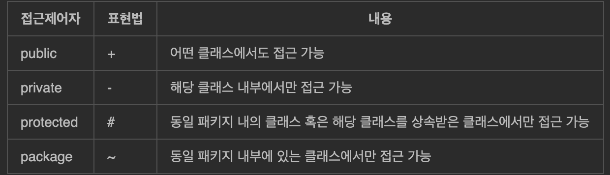

# 1-1. 요구사항 확인
# 1. 소프트웨어 생명 주기
## 가. 소프트웨어 생명 주기
   > 소프트웨어를 개발하기 위해서 정의, 운용, 유지보수 등의 과정을 단계별로 나눈 것
   > - 개발 단계와 각 단계별 주요 활동, 활동 결과에 대한 산출물로 표현
   > - 개발자는 문제의 유형이나 개발 방법 등에 따라 특정 모형을 선택할 수도 있고 개별적인 모형을 선택할 수도 있음
## 나. 소프트웨어 생명 주기 모형
 > 소프트웨어의 생명 주기를 표현하는 형태를 생명주기 모형 혹은 프로세스 모형이라고도 함
### 1) 폭포수 모형
> 타당성 검토 ➡️ 계획 ➡️ 요구분석 ➡️ 설계 ➡️ 구현 ➡️ 테스트 ➡️ 유지보수
>- 각 단계가 끝날 때 확실하게 검토, 승인한 후 다음 단계를 진행하는 개발 방법론(한 단계가 끝나야만 다음 단계로 넘어갈 수 있음)
>- 가장 오래되고 폭넓게 사용됨
>- 제품의 일부가 될 메뉴얼을 작성해야 함
>- 각 단계가 끝나면 다음 단계 수행을 위한 결과물이 명확하게 산출되어야 하고 두 개 이상의 과정이 동시에 수행되지 않음
>- 단점 : 개발이 완료된 시점에서 오류가 발견

### 2) 프로토타입 모형
> 요구수집 ➡️ 빠른 설계 ➡️ 프로토타입 구축 ➡️ 고객 평가 ➡️ 프로토 타입 조정 ➡️ 구현
> - 고객의 요구사항을 정확하게 파악하기 위해서 실제 개발될 소프트웨어의 시제품을 만들어 결과물을 예측하는 모형
> - 시제품은 사용자와 시스템 사이의 인터페이스에 중점을 두어 개발함
> - 만들어진 시제품은 구현단계에서 골격 코드로 사용됨
> - 폭포수 모형의 단점을 보완하기 위한 모형

### 3) 나선형 모형(= 점진적 모형)
> 계획수립 ➡️ 위험분석 ➡️ 개발 및 검증 ➡️ 고객 평가 ➡️ 계획수립 ➡️ 위험분석 ...
> - 폭포수 모형 + 프로토 타입 모형 + 위험 분석 기능
> - 여러 번의 소프트웨어 개발 과정을 거치면서 점진적으로 완벽한 소프트웨어를 개발하는 모형
> - 개발하면서 발생할 수 있는 위험을 관리, 최소화 하는 것이 목적
> - 점진적으로 개발 과정이 반복되기 때문에 변경되는 요구사항을 빼거나 더할 수 있음

### 4) 애자일 모형
> 스프린트 혹은 이터레이션이라고 불리는 짧은 개발주기를 반복하고 반복 주기마다 결과물에 대한 고객의 피드백을 적극 수용
> - 특정 개발론에 중점을 둔 것이 아니라 좋은 소프트웨어를 빠르게 만들기 위해서 '고객과의 소통'에 초점을 맞춘 방법론을 통칭함
> - 각 개발주기마다 생기는 고객의 요구사항에 우선순위를 매겨서 작업을 진행
> - 소규모 프로젝트나 급변하는 요구사항, 숙련된 개발자에 적합함
> - 스크럼, XP, Kanban, Lean, Crystal, ASD(Adaptive Software Development), FDD(Feature Driven Development), DSDM(Dynamic System Development Method), DAD(Disciplined Agile Delivery)등이 애자일 모형을 기반으로 하는 소프트웨어 개발 모형
#### 가) 스크럼 기법
1. 스크럼이란
   > 팀이 중심이 되어 개발의 효율성을 높인다는 의미가 내포됨
   > - 팀원 스스로가 스크럼 팀을 구성하고 개발 작업에 관한 모든 것을 스스로 해결할 수 있어야 함
2. 스크럼의 구성요소
   >1. 제품책임자(PO : Product Owner)
    >   - 이해관계자들 중 제품에 대한 이해도가 높고, 의사결정을 하는 사람으로 선정, 주로 개발 의뢰자, 사용자
    >   - 요구사항이 담긴 백로그 작성 및 백로그에 대한 우선순위 지정
    >   - 팀원들이 백로그에 스토리를 추가할 수 있지만 우선순위를 정할 수는 없음
    >       * 백로그(Backlog) : 제품 개발에 필요한 요구사항을 모두 모아 우선순위를 부여해 놓은 목록
    >       * 스토리(Story) : 백로그에 담겨질 요구사항(단어가 아닌 서술형태 예 : 고객은 상품을 주문하기 위해서 로그인을 해야 한다.)
   
   >2. 스크럼 마스터(SM : Scrum Master)
   >    - 스크럼 팀이 스크럼을 잘 수행할 수 있도록 조언을 해주는 역할(팀원의 통제가 목적X)
   >    - 스크럼 회의 주관 및 진행사항 점검 -> 개발 시 발생한 장애 요소 공론화하여 처리
   
   >3. 개발팀(DT : Development Team)
   >    - PO와 SM을 제외한 모든 팀원(개발자 뿐만 아니라 디자이너, 테스터 등 개발에 참여하는 모든 사람)
   >    - 보통 7~8명이 적당함
3. 스크럼 개발 프로세스
   > 1. 제품 백로그
   >    - 제품 개발에 필요한 요구사항을 모아 우선순위에 따라 나열한 목록으로 요구사항의 변동에 따라 지속적으로 업데이트 됨
   >    - 백로그에 작성된 스토리를 기반으로 제품 릴리즈 계획을 수립 
   > 2. 스프린트 계획 회의
   >    - 이번 스프린트에서 수행할 작업을 대상으로 단기 일정을 수립하는 것
   >    - 스프린트에서 처리할 요구사항을 개발자들이 나눠서 작업할 수 있도록 테스크 단위로 분할, 스프린트 백로그 작성
   >        * 스프린트 백로그 : 개발자별로 수행할 작업 목록
   > 3. 스프린트
   >    - 실제 개발 작업 진행(보통 2~4주)
   >    - 스프린트 백로그에 작성된 테스크의 작업 시간(양)을 추정하여 개발 담당자에게 할당
   >    - 할당된 테스크는 To-Do, In Progress, Done의 상태로 나뉨
   > 4. 일일 스크럼 회의
   >    - 매일 모든 팀원이 10~15분 정도의 짧은 시간동안 진행상황을 점검
   >    - 보통 서서 진행하며, 남은 작업 시간은 소멸 차트에 표시
   >    - 스크럼 마스터는 발견되는 장애요소를 해결할 수 있도록 도와줘야 함
   > 5. 스프린트 검토 회의
   >    - 사용자가 참석하여 요구사항이 잘 반영되어 만들어졌는지 테스트를 수행
   >    - 스프린트의 한 주당 한 시간 내
   >    - PO는 개선사항에 대한 피드백을 정리하여 백로그에 업데이트하여 개발자들이 다음 스프린트에 반영할 수 있도록 해야함
   > 6. 스프린트 회고
   >    - 스프린트 주기를 돌아보면 규칙은 잘 준수했는지, 개선사항 등을 확인 및 기록

#### 나). XP기법
1. XP기법이란
    > 수시로 발생하는 고객의 요구사항에 유연하게 대처하기 위해 고객의 참여와 개발 과정을 반복을 극대화하여 개발 생산성을 향상시키는 방법
    > - 짧고 반복적인 개발주기, 단순한 설계, 고객의 적극적인 참여 ➡️ 빠른 개발을 목적
    > - 릴리즈 기간을 짧게 반복 ➡️ 고객의 요구사항 반영에 대한 가시성을 높임
    > - 릴리즈 테스트마다 고객을 참여 시킴
    > - 소규모 인원 프로젝트에 적합함
                  
    > * XP의 핵심가치 
    >   - 의사소통(Communication)
    >   - 단순성(Simplicity)
    >   - 용기(Courage)
    >   - 존중(Respect)
    >   - 피드백(Feedback)
2. XP 개발 프로세스
    > 사용자 스토리 ➡️ 릴리즈 계획 수립 ➡️ 스파이크 ➡️ 이터레이션 ➡️ 승인검사 ➡️ 소규모 릴리즈
    >    
    > 출처 : https://sites.google.com/site/anyflow/some-summaries/s-w-gonghag/xp-extreme-programming?tmpl=%2Fsystem%2Fapp%2Ftemplates%2Fprint%2F&showPrintDialog=1

    > 1. 사용자 스토리
    >   - 고객의 요구사항을 시나리오로 표현한 것
    >   - 기능 단위로 구성하며 간단한 테스트 케이스도 작성함
    > 2. 릴리즈 계획 수립
    >   - 부분 혹은 전체 개발 완료 시점에 대한 일정 수립
    >   - 여기서 릴리즈란 : 몇 개의 스토리가 적용되어 '부분적으로 기능이 완료된 제품'을 제공하는 것 
    > 3. 스파이크
    >   - 요구사항의 신뢰성을 높이고 기술 문제에 대한 위험을 감소시키기 위해 별도로 만드는 간단한 프로그램
    >   - 처리할 문제외의 다른 조건은 모든 무시하고 작성    
    > 4. 이터레이션
    >   - 1~3주 정도의 기간으로 진행되는 하나의 릴리즈를 더 세분화한 단위
    >   - 이터레이션 기간 중 새로운 스토리가 작성될 수도 있음(이 새로운 스토리는 이번 이터레이션에 포함될 수도 있고 다음 이터레이션에 포함될 수도 있음) 
    > 5. 승인검사(= 인수 테스트)
    >   - 하나의 이터레이션 안에서 계획된 릴리즈 단위의 부분 완료 제품이 구현되면 수행하는 테스트
    >   - 사용자 스토리에 기재된 테스트 사항에 대해 고객이 테스트 수행함
    >   - 테스트 시 발견된 오류는 다음 이터레이션에 포함되고 새로운 요구사항이 추가되거나 우선순위가 변동될 수 있음
    >   - 테스트가 완료되면 다음 이터레이션을 진행
    > 6. 소규모 릴리즈
    >   - 소규모 릴리즈의 장점 : 고객의 반을을 기능별로 확인할 수 있음 ➡️ 요구사항에 유연하게 대처 가능
    >   - 계획된 릴리즈 기간 동안 이터레이션이 모든 완료되면 고객이 최종 테스트를 진행한 후 최종 결과물을 고객에게 전달(릴리즈)

> XP의 주요 실천방법
> - 짝 프로그래밍(Pair Programming) : 다른사람과 함께 프로그래밍을 하면서 개발에 대한 책임을 공동으로 나눠 갖는 환경을 조성
> - 공통 코드 소유(Collective Ownership) : 개발 코드에 대한 권한과 책임을 공동으로 소유
> - 테스트 주도 개발(Test-Driven Development) : 개발자가 실제 코드를 작성하기 전에 테스트 케이스를 먼저 작성(자동화된 테스팅 도구 사용)
> - 전체 팀(Whole Team) : 개발에 참여하는 모든 구성원은 자신의 역할이 있고 그 역할에 대한 책임을 가져야 함(고객 또한 팀의 일원)
> - 지속적인 통합(Continuous Integration) : 모듈 단위로 개발된 코드들은 하나의 작업이 마무리될 떄마다 통합되어야 함
> - 디자인 개선 또는 리팩토링(Design Improvement, Refactoring) : 프로그램 기능 변경 없이 단순화, 유연성 강화 등 시스템을 재구성, 및 성능 및 유지보수성 모두에서 최적화된 코드의 유지
> - 소규모 릴리즈(Small Release) : 짧은 릴리즈 기간의 반복을 통해 고객의 요구사항에 신속하게 대응할 수 있음

#### 다. 애자일 개발 4가지 핵심 가치
> 1. 프로세스와 도구보다는 개인과 상호작용에 더 가치를 둔다.
> 2. 방대한 문서보다는 실행되는  SW에 더 가치를 둔다.
> 3. 계약 협상보다는 고객과 협업에 더 가치를 둔다.
> 4. 계획을 따르기 보다는 변화에 반응하는 것에 더 가치를 둔다.

#### 라. 애자일 개발 12가지 실행지침
> 1. 유용한 소프트웨어를 빠르고 지속적으로 제공하여 고객을 만족시킨다.
> 2. 개발 막바지라도 요구사항 변경을 적극 수용한다.
> 3. 몇 개월이 아닌 몇 주 단위로 실행되는 소프트웨어를 제공한다.
> 4. 고객과 개발자가 프로젝트 기간에 함께 일한다.
> 5. 개발에 대한 참여 의지가 확실한 사람들로 팀을 구성하고 필요한 개발 환경과 지원을 제공, 일을 잘 끝낼 수 있도록 신뢰한다.
> 6. 같은 사무실에서 얼굴을 맞대고 의견을 나눈다.
> 7. 개발의 진척도를 확인하는 1차 기준은 작동하는 소프트웨어이다.
> 8. 지속 가능한 개발을 장려하고 일정한 속도로 개발을 진행한다.
> 9. 기술적 우수성과 좋은 설계에 지속적인 관심을 기울이면 민첩성이 향상된다.
> 10. 단순화를 추구한다.
> 11. 최상의 아키텍처, 명확한 요구사항, 최상의 설계는 자기 스스로 일을 주도하는 조직적인 팀으로부터 나온다.
> 12. 더 효과적인 팀이 될 수 있는 방안을 정기적으로 깊이 고민하고 그에 따라 팀의 행동을 조정한다.

# 2. 현행 시스템 파악
## 가. 현행 시스템 파악 절차
> - 현행 시스템이 어떤 하위 시스템으로 구성되어 있는지, 제공하는 기능이 무엇인지, 다른 시스템들과 어떤 정보를 주고받는지, 어떤 기술요소를 사용하고 있는지, 사용하고 있는 소프트웨어 및 하드웨어는 무엇인지, 네트워크는 어떻게 구성되어 있는지 등을 파악하는 활동
> - 현행 시스템을 분석 ➡️ 개발하고자 하는 응용소프트웨어가 이후 적용될 목표시스템을 명확하고 구체적으로 기술
> - 새로 개발하려는 시스템의 개발 범위를 명확하게 하기 위해서 3단계로 나누어 현행 시스템을 파악함
### - 1단계
#### 시스템 구성 파악
>- 기간 업무 : 조직의 주요 업무를 담당
>- 지원 업무 : 기간 업무를 지원
>- 조직 내 모든 정보시스템의 현황을 파악할 수 있도록 단위 업무 정보시스템들의 명칭, 주요 기능들을 명시함

<예시> 

|구분|시스템명|시스템내용|비고|
|---|---|---|---|
|여신관리 업무|여신기획 관리 시스템|여신 기획 관리를 위한 여신요율 책정, 연간 여신운용지침 수립 등의 기능을 제공하는 시스템|
|고객관리 업무|고객등록 처리 시스템|고객의 기본 정보를 관리하기 위한 등록, 변경, 조회, 삭제 등의 기능을 제공하는 시스템

#### 시스템 기능 파악
>- 단위 업무 시스템이 현재 제공하는 기능들을 주요 기능과 하부기능, 세부기능으로 구분하여 계층형으로 표시
 
<예시>

|단위 업무 시스템|Level1  주요 업무 기능|Level2  세부 업무 기능|Level3  세부 업무 기능 활동|비고|
|---|---|---|---|---|
|여신상담 관리|여신기획 관리|여신요율 책정|
|여신상담 관리|여신기획 관리|연간 여신운용지침 수립|
|여신상담 관리|여신상담 관리|거래처정보 관리|거래처정보 등록|
|여신상담 관리|여신상담 관리|거래처정보 관리|신용정보 관리|

#### 시스템 인터페이스 파악
> - 단위 업무 시스템 간에 주고받는 데이터의 종류, 형식, 프로토콜, 연계 유형, 주기 등을 명시
> - 데이터를 어떤 형식으로 주고 받는지, 통식규약은 무엇인지, 연계유형은 무엇인지 등을 반드시 고려해야 함
>   - 데이터 형식 : XML, 고정 포맷, 가변 포맷 등
>   - 통신 규약 : TCP/IP, X.25 등
>   - 연계 유형 : EAI, FEP등

<예시>

|송신 시스템|수신 시스템|연동 데이터|연동 형식|통신규약|연계 유형|주기|
|---|---|---|---|---|---|---|
|여신상담 관리 시스템|여신관리센터|연체 정보|XML|TCP/IP|EAI|하루(일)|
|여신상담 관리 시스템|여신금융협회|부도 정보|XML|X.25|FEP|수시|

### - 2단계
#### 아키텍처 구성 파악
> - 기간 업무 수행에 어떠한 기술 요소들이 사용되는지 최상위 수준에 계층별로 표현한 아키텍쳐 구성도를 작성
>   - 단위 업무 시스템 별로 아키텍처가 다른 경우, 가장 핵심이 되는 기간 업무처리 시스템을 기준으로 작성

<예시> 

출처 : https://funyphp.com/archive/knowledge/159?sfl=mb_id%2C1&stx=webmaster&sst=wr_nogood&sod=asc&sop=and&page=6&device=pc

#### 소프트웨어 구성 파악
> - 단위 업무 시스템 별로 업무 처리를 위해 설치되어 있는 소프트웨어의 제품명, 용도, 라이센스 적용 방식, 라이센스 수 등을 명시

<예시>

|구분|시스템명|SW제품명|용도|라이센스 적용방식|라이센스 수|
|:---|:---|:---|:---|:---|---:|
|여신관리 업무|거래처정보 관리 시스템|Apache Tomcat|WAS|오픈소스  Apache License|1|
|여신관리 업무|거래처정보 관리 시스템|MySQL|데이터베이스|GPL 또는 상용|1|
|여신관리 업무|거래처정보 관리 시스템|UNIX|운영체제|GNU GPL|1|
|여신관리 업무|대출의향서 발급 시스템|Sage|ERP|상용|1|

### - 3단계
#### 하드웨어 구성 파악
> - 단위 업무 시스템들이 운용되는 서버의 주요 사양, 수량, 이중화 적용 여부를 명시
>   - 서버의 이중화 : 운용 서버의 장애 시 대기 서버로 서비스를 계속 운용할 수 있도록, 운용 서버의 데이터 변경이 예비 서버에도 동일하게 복제 되도록 관리하는 것
>   - 기간 업무의 서비스 기간, 장애 대응 정책 등에 따라 이중화 적용 여부가 결정됨

<예시>

|구분|시스템명|서버용도|제품명|주요 사양|수량|이중화|
|:---|:---|:---|:---|:---|---:|:---:|
|여신관리업무|여신정보 관리 시스템|AP서버|HPE ProLiant DL360 Gen10 서버|-CPU : 2.6Ghz 8core/24T X 2ea, 30MB Cache - Memory : 8GB RDIMM, 2133MT/s X 8ea ...|1|N|
|여신관리업무|여신정보 관리 시스템|DB서버|HPE Integrity Superdome 2 서버|-CPU : 3.2Ghz 12core/24T X 2ea, 50MB Cache - Memory : 16GB RDIMM, 2133MT/s X 8ea ...|1|Y|

#### 네트워크 구성 파악
> - 업무 시스템들의 네트워크 구성을 파악할 수 있도록 서버의 위치, 서버 간 네트워크 연결 방식을 네트워크 구성도로 작성
>   - 이를 통해 서버들의 물리적인 위치 관계 파악, 보안 취약성 분석하여 대응할 수 있음
>   - 네트워크 장애 발생 시 원인을 찾아 복구하기 위한 용도로 활용 가능

<예시>

출처 : https://funyphp.com/archive/knowledge/159?sfl=mb_id%2C1&stx=webmaster&sst=wr_nogood&sod=asc&sop=and&page=6&device=pc

# 3. 개발 기술 환경 파악
## 가. 개발기술 환경이란
> - 개발하고자 하는 소프트웨어와 관련된 운영체제, DBMS, 미들웨어 등을 선정할 때 고려할 사항을 기술하고 오픈소스 사용 시 주의할 내용을 게시

### 1) 운영체제(Operating System)
> - 컴퓨터 시스템의 자원들을 효율적으로 관리, 사용자가 컴퓨터를 편리하고 효율적으로 사용할 수 있도록 환경을 제공하는 소프트웨어
> - 컴퓨터 운영체제 : Windows, UNIX, Linux, Mac OS 등
> - 모바일 운영체제 : Android, iOs

> - 운영체제 요구사항 식별 시 고려사항
>   - 가용성 : 장시간 운영으로 발생할 수 있는 고유의 장애 가능성, 메모리 누수로 인한 성능 저하 및 재가동 등
>   - 성능 : 대규모 사용자 동시 요청 처리, 대용량 파일 작업, 지원 가능한 메모리 크기 등
>   - 기술지원 : 오픈소스 여부, 사용자들간의 정보 공유, 제작업체의 안정적이 기술지원 등
>   - 주변기기 : 설치가능한 하드웨어, 주변기기 지원여부
>   - 구축비용 : 지원 가능한 하드웨어 비용, 설치할 응용프로그램 라이센스 비용, 총 소유 비용 등

### 2) 데이터베이스 관리 시스템(DBMS)
> - 사용자와 데이터베이스 사이에서 정보를 생성해 주고, 데이터베이스를 관리해 주는 소프트웨어
> - 기존 파일 시스템이 갖는 데이터의 종속성과 중복성의 문제를 해결하기 위해 제안된 시스템
> - Oracle, IBM DB2, Microsoft SQL Server, MySQL, SQLite, MongoDB, Redis 등

> - DBMS 관련 요구사항 식별 시 고려사항
>   - 가용성 : 장시간 운영으로 발생할 수 있는 고유의 장애 가능성, 백업이나 복구의 편의성, DBMS 이중화 및 복제 지원 등
>   - 성능 : 대규모 데이터 처리 성능, 대용량 트랜젝션 처리 성능, 다양한 튜닝 옵션 등
>   - 기술지원 : 오픈소스 여부, 사용자들간의 정보 공유, 제작업체의 안정적이 기술지원 등
>   - 상호 호환성 : 설치 가능한 운영체제의 종류, JDBC, ODBC와의 호환 여부
>   - 구축 비용 : 라이센스 정책 및 비용, 유지관리 비용, 총 소유 비용 등

### 3) 웹 애플리케이션 서버(WAS)
> - 사용자의 요청에 따라 변하는 동적인 컨텐츠를 처리하기 위해 사용되는 미들웨어
> - 데이터 접근, 세션 관리, 트랜젝션 관리 등을 위한 라이브러리 제공
> - 데이터베이스 서버와 연동해서 사용함
> - Tomcat, GlassFish, JBoss, Jetty 등

> - 웹 애플리케이션 서버 관련 요구 사항 식별 시 고려사항
>   - 가용성 : 장시간 운영으로 발생할 수 있는 고유의 장애 가능성, WAS 결함으로 인한 패치 설치를 위한 재가동, 안정적인 트랜젝션 처리, WAS 이중화 지원
>   - 성능 : 대규모 트랜잭션 처리 성능, 다양한 설정 옵션, GC의 다양한 옵션
>   - 기술 지원 : 제조업체의 안정적인 기술지원, 여러 사용자들 간의 정보 공유, 오픈 소스 여부
>   - 구축 비용 : 라이센스 비용, 유지관리 비용, 총 소유 비용 등

# 4. 요구사항 정의

## 가. 요구사항이란
> - 소프트웨어가 어떤 문제를 해결하기 위해 제공하는 서비스에 대한 설명과 정상적으로 운영되는데 필요한 제약조건 등 
> ➡️ 개발에 참여하는 이해관계자들 간의 의사소통을 원활하게 하는데 도움을 주며
> - 요구사항이 제대로 정의되어야 이후 과정의 목표와 계획을 수립할 수 있음

## 나. 요구사항의 유형
>- 기능/비기능 
>   - 기능
>       - 시스템이 무엇을 하는지 어떤 기능을 하는지
>       - 입/출력으로 무엇을 포함해야 하는지, 어떤 데이터를 저장하고 연산해야 하는 지 
>       - 시스템이 반드시 수행해야 하는 기능
>       - 사용자가 제공받고자 하는 기능
>   - 비기능 
>       - 시스템 장비 구성요소 : 하드웨어, 소프트웨어, 네트워크 등
>       - 성능 요구사항 : 처리 속도 및 시간, 처리량 등
>       - 인터페이스 요구사항 : 시스템 인터페이스와 사용자 인터페이스에 대한 요구사항 (다른 시스템과의 정보 교환에 사용되는 프로토콜 등)
>       - 데이터 요구사항 
>       - 테스트 요구사항
>       - 보안 요구사항 
>       - 품질 요구사항 
>       - 제약사항
>       - 프로젝트 관리 요구사항
>       - 프로젝트 지원 요구사항

> - 사용자/시스템
>   - 사용자 
>       - 사용자 관점에서 본 시스템이 제공해야 할 요구사항
>       - 사용자를 위한 것이므로 이해하기 쉽게 작성해야 함
>   - 시스템(= 소프트웨어 요구사항) 
>       - 개발자 관점에서 본 시스템 전체가 사용자와 다른 시스템에 제공해야 할 요구사항
>       - 전문적이고 기술적인 용어로 표현

## 다. 요구사항 개발 프로세스
> -  도출 ➡️ 분석 ➡️ 명세 ➡️ 확인
> - 프로세스 진행 전 작성한 보고서(예산은 적정한지, 비지니스 목적에 부합하는 지 등)를 바탕으로 타당성 조사를 선행해야 함

#### 1) 요구사항 도출
> - 시스템, 사용자, 시스템 개발에 관련된 사람들이 서로 의견을 교환하고 요구사항이 어디 있는지, 어떻게 수집할 것인지를 식별하고 이해하는 과정
> - 개발자와 고객 관계 형성 및 이해관계자 식별 ➡️ 이해관계자들 간 의사소통이 중요
> - 소프트웨어 개발 생명 주기 동안 지속적으로 반복
> - 청취, 인터뷰, 설문, 브레인스토밍, 워크샵, 프로토타이핑, 유스케이스 등

#### 2) 요구사항 분석
> 가) 요구사항 분석이란
> - 사용자의 요구 사항 중 명확하지 않거나 모호하거나 이해되지 않는 부분을 발견하고 걸러내기 위한 과정으로 사용자의 요구사항을 이해하고 문서(명세)화 하는 과정
>   - 요구사항의 타당성을 조사, 비용 및 일정에 대한 제약 설정
>   - 상충되는 요구사항을 중재하는 과정
>   - 자료흐름도, 자료사전 등
> - 요구사항 분석의 결과는 소프트웨어 설계 시 기본이 되는 자료이므로 정확하고 일관성 있게 분석, 문서화 해야 함

> 나) 구조적 분석 기법
>   - '자료의 흐름과 처리를 중심'으로 하는 요구사항 분석 방법
>       - 도형 중심의 분석도구와 절차를 이용, 사용자의 요구사항을 파악하여 문서화  ➡️ 도형을 사용하여 분석가와 사용자 간 대화가 용이함
>       - 하향식 방법을 사용 ➡️ 시스템 세분화, 분석 중복 배제
>       - 요구사항을 논리적으로 표현 ➡️ 전체 시스템을 일관성 있게 이해 가능 
>       - 시스템 분석 질의 향상 및 시스템 개발의 모든 단계에서 필요한 명세서 작성 가능
>       - 자료흐름도(DFD), 자료사전(DD), 개체관계도(ERD), 소단위 명세더 등을 이용하여 모델링
> 
> 
>       - 자료흐름도(DFD : Data Flow Diagram)
>           - 자료의 흐름 및 변환 과정, 기능을 도형 중심으로 기술하는 방법(= 자료 흐름 그래프, 버블 차트)
>           - 시스템 안의 프로세스와 자료 저장소 사이의 자료의 흐름을 나타내는 그래프
>           - 자료는 처리를 거쳐 변환될 때마다 새로운 이름이 부여, 처리는 입력 자료가 발생하면 기능을 수행한 후 출력 자료를 산출
>           - 기호  
>               - 프로세스 : 자료를 변환시키는 시스템의 한 부분(= 처리, 기능, 변환, 버블), 원, 둥근 사각형으로 표시하고 프로세스 이름 기입 
>               - 자료 흐름 : 자료의 흐름이나 연관관계, 화살표 위에 자료의 이름을 기입
>               - 자료 저장소 : 파일, 데이터베이스를 나타냄, 도형 안에 자료 저장소 이름을 기입 
>               - 단말 : 시스템과 교신하는 외부 개체 ➡️ 입력 데이터가 만들어지고 출력 데이터를 받음, 도형 안에 단말 이름을 기입
>  
>       - 자료 사전(DD : Data Dictionary)
>           - 자료 흐름도에 있는 자료를 더 자세히 정의하고 기록한 것(데이터를 설명하는 데이터 = 메타데이터)
>           - 기호 
>               - = : 자료의 정의(~로 구성되어 있다)
>               - + : 자료의 연결(and)
>               - () : 자료의 생략(생략 가능한 자료)
>               - [|] : 자료의 선택(or)
>               - {} : 자료의 반복
>               - \* * : 자료의 설명(주석)

> 다) 요구사항 분석을 위한 CASE(자동화 도구)
> - 요구사항을 자동으로 분석하고, 요구사항 분석 명세서를 기술하도록 개발된 도구
> - 요구사항 분석을 위한 자동화 도구 사용의 이점
>   - 표준화와 보고를 통한 문서 품질 개선
>   - 분석자들 간의 적절한 조정
>   - 결함, 생략, 불일치 등의 발견 용이성
>   - 변경이 주는 영향 추적 용이
>   - 명세에 대한 유지보수 비용 축소
> - 종류 
>   - SADT(Structured Analysis and Design Technique)
>   - SREM(Software Requirements Engineering Methodology)
>   - PSL/PSA
>   - TAGS(Technology for Automated Generation of Systems)
>   
> - HIPO(Hierarchy Input Process Output) 
>   - 시스템의 분석 및 설계, 문서화할 때 사용되는 기법 ➡️ 입/출력, 처리의 기능을 나타냄
>   - 기본 시스템 모델 구성 : 입력, 처리, 출력 ➡️ 하향식 소프트웨어 개발을 위한 문서화 도구
>   - 체계적인 문서관리가 가능
>   - 기호, 도표를 사용 ➡️ 이해하기 쉬움
>   - 기능과 자료의 의존관계를 동시에 표현할 수 있음
>   - 변경 및 유지보수가 용이
>   - HIPO Chart : 시스템의 기능을 여러 개의 모듈로 분할하여 이들 간의 인터페이스를 계층 구조로 표현한 것
>       - 종류
>           - 가시적 도표(도식 목차) : 시스템의 전체적인 기능과 흐름을 보여주는 계층 구조도
>           - 총체적 도표(총괄 도표) : 프로그램을 구성하는 기능을 기술한 것 ➡️ 입력, 처리, 출력에 대한 전반적인 정보를 제공
>           - 세부적 도표(상세 도표) : 총체적 도표에 표시된 기능의 구성요소들을 상세히 기술 

# 5. UML
## 가. UML이란
> - 시스템 개발 과정에서 개발자와 고객 또는 개발자 간의 의사소통을 원활하게 하기 위해 표준화한 객체지향 모델링 언어
> - 6개의 구조적 다이어그램과 7개의 행위 다이어그램 작성 가능

## 나. UML의 구성요소
### 1) 사물
> - 다이어그램 안에서 관계가 형성될 수 있는 대상(가장 중요한 기본요소)
> - 종류
>   - 구조 사물 : 시스템의 개념, 물리적 요소 표현(클리스, 유스케이스, 컴포넌트, 노드 등) 
>   - 행동 사물 : 시간과 공간에 따른 요소들의 행위를 표현(상호작용, 상태 머신 등)
>   - 그룹 사물 : 요소들을 그룹으로 묶어서 표현(패키지)
>   - 주해 사물 : 부가적인 설명이나 제약조건 등을 표현(노트)

### 2) 관계
> - 사물과 사물 사이의 연관성을 표현
> - 종류 
>   - 연관 관계 : 2개 이상의 사물이 서로 관련되어 있음을 표현
>       - 사물 사이 : 실선
>       - 방향성 : 화살표
>       - 양방향 관계 : 실선으로만 연결(화살표 생략)
>       - 다중도(연관도에 참여하는 객체의 개수)를 선 위에 표기 
>  
>   
>   - 집합 관계 : 하나의 사물이 다른 사물에 포함되어 있는 관계를 표현
>       - 포함하는 쪽(전체, Whole)과 포함되는 쪽(부분, Part)은 서로 독립적
>       - Part에서 Whole쪽으로 속이 빈 마름모를 연결하며 표현 
>   
>   - 포함 관계 : 집합 관계의 특수한 형태 ➡️ 포함하는 사물의 변화가 포함되는 사물에 영향을 미치는 관계
>       - 포함하는 쪽(전체, Whole)과 포함되는 쪽(부분, Part)은 서로 독립적일 수 없음 ➡️ 생명주기를 함께 함
>       - Part에서 Whole쪽으로 속이 채워진 마름모를 연결하며 표현  
>  
>   - 일반화 관계 : 하나의 사물이 다른 사물에 비해 더 일반적인지 구체적인지 표현
>       - 보다 일반적인 개념을 상위(부모), 구체적인 개념을 하위(자식)
>       - 자식에서 부모 쪽으로 속이 빈 화살표를 연결하여 표현  
>  
>   - 의존 관계 : 서로 연관이 있지만, 필요에 의해 서로에게 짧은 시간동안만 영향을 주는 관계
>       - 소유관계는 아니지만 사물의 변화가 다른 사물에도 영향을 미치는 관계
>       - 일반적으로 한 클래스가 다른 클래스를 오퍼레이션의 매개 변수로 사용하는 경우 나타남
>       - 영향을 주는 사물이 영향을 받는 사물 쪽으로 점선 화살표를 연결하여 표현  
>  
>   - 실체화 관계 : 사물이 할 수 있거나 해야 하는 기능으로 서로를 그룹화 할 수 있는 관계
>       - 한 사물이 다른 사물에게 오퍼레이션을 수행할 수 있도록 지정하는 의미의 관계
>       - 사물에서 기능 쪽으로 속이 빈 점선 화살표를 연결하여 표현  
>  
> 그림출처 : https://chance0523.github.io/%EC%A0%95%EC%B2%98%EA%B8%B0/2020/07/31/EIP-1-1-2/

### 3) 다이어그램
> - 사물과 관계를 도형으로 표현한 것
> - 여러 관점에서 시스템을 가시화한 뷰를 제공 ➡️ 의사소통에 도움
> - 정적 모델링 : 주로 구조적 다이어그램을 사용
> - 동적 모델링 : 주로 행위 다이어그램을 사용
>   
> - 구조적(Structual) 다이어그램 
>   - 클래스 다이어그램(Class Diagram) 
>       - 시스템을 구성하는 클래스, 속성과 오퍼레이션, 속성과 오퍼레이션에 대한 제약조건 , 클래스 사이의 관계를 표현
>       - 시스탬 구성요소를 문서화하는데 사용
>       - 코딩에 필요한 요소(객체 속성, 함수 등의 정보)를 표현 ➡️ 시스템 모델링에 자주 사용
>       - 구성요소 
>           - 클래스 : 각 객체들이 갖는 속성과 오퍼레이션으로 표현(3개의 구획으로 나눠 클래스 이름, 속성, 오퍼레이션으로 표기) 
>           - 제약조건 : 속성에 입력될 값에 대한 제약이나 오퍼레이션 수행 전후에 지정해야할 조건을 표기
>           - 관계 : 클래스와 클래스 사이의 연관성을 표현
>               \* 연관 관계, 집합 관계, 포함 관계, 일반화 관계, 의존 관계
>       - 접근제어자
>
>   - 객체 다이어그램(Obejct Diagram) : 클래스에 속한 사물들을 특정 시점의 객체 와 객체 사이의 관계로 표현, 럼바우 객체지향 분석기법 ➡️ 객체 모델링에 활용
>   - 컴포넌트 다이어그램(Component Diagram) : 컴포넌트(실제 구현 모듈) 간 관계나 인터페이스를 표현(구현단계에서 사용)
>   - 배치 다이어그램(Deployment Diagram) : 결과물, 프로세스, 컴포넌트 등 물리적 요소들의 위치를 표현, 노드와 통신 경로로 표현(구현단계에서 사용)
>   - 복합체 구조 다이어그램(Composite Structure Diagram) : 클래스나 컴포넌트가 복합구조를 갖는 경우 그 내부 구조를 표현
>   - 패키지 다이어그램(Package Diagram) : 유스케이스, 클래스 등의 모델 요소를 그룹화한 패키지들의 관계를 표현
>   
> - 행위(Behavioral) 다이어그램
>   - 유스케이스 다이어그램(Use CaseDiagram)
>       - 개발될 시스템과 관련 외부 요소들을 이용하여 수행할 수 있는 기능을 사용자의 관점에서 표현한 것
>       - 특징 
>           - 외부요소와 시스템 간의 상호작용 확인
>           - 사용자의 요구사항 분석 도구로 활용
>           - 시스템의 범위 확인 가능
>       - 구성요소
>           - 시스템/시스템 범위(System/System Scope) : 시스템 내부에서 수행되는 기능들을 외부 시스템과 구분하기 위해 내부 유스케이스들을 사각형으로 묶어 시스템의 범위를 표현 
>           - 액터(Actor) : 시스템과 상호작용하는 모든 외부요소로 주액터와 부액터로 구분
>               \* 주액터 : 시스템을 사용함으로써 이득을 얻는 대상 (주로 사람)
>               \* 부액터 : 주액터의 목적을 달성하기 위해 시스템에 서비스를 제공하는 외부 시스템
>           - 유스케이스(Use Case) : 사용자가 보는 관점에서 시스템이 액터에게 제공하는 서비스 또는 기능을 표현한 것
>           - 관계(Relationship) : 액터와 유스케이스, 유스케이스와 유스케이스 
>               \* 포함관계 : 
>               \* 확장관계 :  
>               \* 일반화 관계 : 
>   - 시퀀스 다이어그램(Sequence Diagram) 
>       - 시스템이나 객체들이 메시지를 주고받으며 시간의 흐름에 따라 상호작용하는 과정을 그림으로 표현한 것
>       - 각 동작에 참여하는 시스템이나 객체들의 수행기간 확인 가능
>       - 기능 모델링에서 작성한 유스케이스 명세서를 하나의 표현 범위로 함
>       - 하나의 클래스를 포함한 하나의 오퍼레이션을 하나의 표현 범위로 하기도 함
>       - 구성요소 
>           - 액터(Actor) : 시스템으로부터 서비스를 요청하는 외부요소(사람, 외부시스템) 
>           - 객체(Object) : 메시지를 주고 받는 주체
>           - 생명선(Lifeline) : 객체가 메모리에 존재하는 기간(객체 아래쪽에 점선을 그어 표현)
>           - 실행 상자(Active Box) : 객체가 메시지를 주고 받으며 구동되고 있음을 표현
>           - 메시지(Message) : 객체가 상호 작용을 위해 주고받는 메시지
>   - 커뮤니케이션 다이어그램(Communication Diagram) : 시퀀스처럼 객체들 간의 메시지를 표현 + 객체들 간의 연관관계까지 표현
>   - 상태 다이어그램(State Diagram) : 하나의 객체가 자신이 속한 클래스의 상태 변화, 다른 객체와의 상호작용에 따른 상태가 어떻게 변화하는지 표현, 럼바우 객체지향 분석기법 ➡️ 객체 모델링에 활용
>   - 활동 다이어그램(Activity Diagram) : 시스템이 어떤 기능을 수행하는지 처리 로직이나 조건에 따른 흐름을 순서에 따라 표현
>   - 상호작용 개요 다이어그램(Interaction Overview Diagram) : 상호작용 다이어그램 간의 제어 흐름을 표현
>   - 타이밍 다이어그램(Timing Diagram) : 객체 상태 변화와 시간 제약을 명시적으로 표현
>   
> - 스테레오 타입
